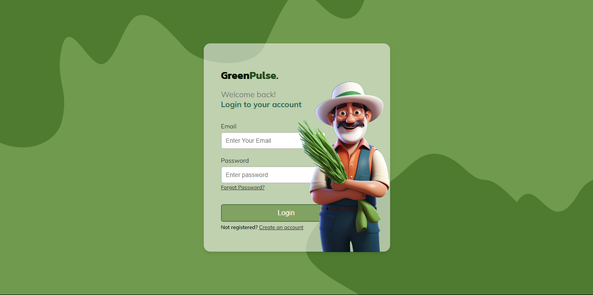
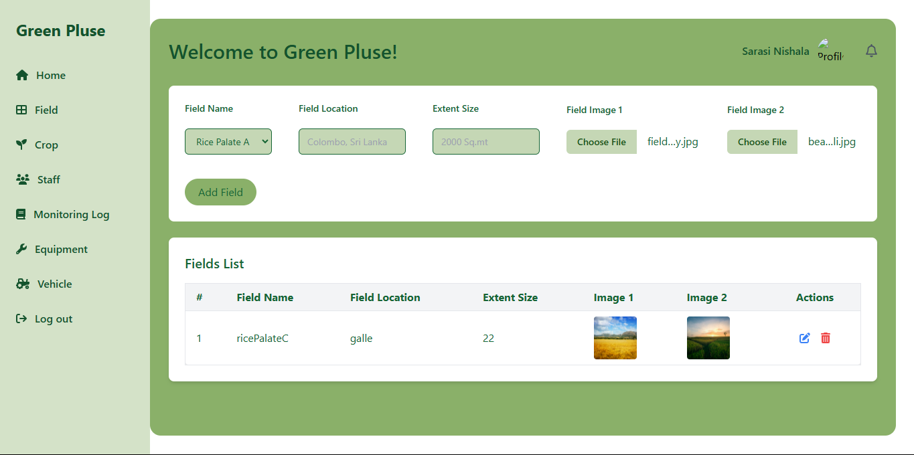

# GreenPulse

GreenPulse is a modern and responsive frontend application built with **React**, **Tailwind CSS**, and **TypeScript**. It provides a sleek and user-friendly interface designed for seamless interaction and optimal performance.

---

## Features

- **React**: Efficient and component-based development.
- **Tailwind CSS**: Utility-first CSS framework for rapid UI design.
- **TypeScript**: Type-safe JavaScript for better maintainability.
- **Responsive Design**: Looks great on all devices.

---

## Installation

1. Clone the repository:
   ```bash
   git clone https://github.com/yourusername/greenpulse-frontend.git

## Screenshot


# Login


# Field


Other pages are same as this

